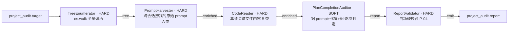

# project_audit Team 群 设计文档

## 一、状态
- 阶段: v2 可跑(2026-06-20 扩)。v1(2026-06-19)只读文件路径;v2 补 PromptHarvester(捞我的原始 prompt)+ CodeReader(真读代码内容)+ ProjectDiscoverer(发现项目)+ CompletenessCritic(完整性临界),修了 v1"只看路径"的硬伤。
- 红绿冒烟:`_smoke.py` 全绿(三 team 接线 + TreeEnumerator/PromptHarvester/CodeReader 真跑 + Completeness 红绿)。ProjectDiscoverer 实跑 13.4s/2872 会话,发现 owned 项目若干。
- 主实施: Claude Code(在作者指示下)。

## 二、核心目的
服务于**诚实的作品集**:遍历我每个项目的真实文件,**只凭两类真源**还原它的全貌与完成度——
- **A 类·我的原始 prompt**:我在本地 claude/codex 亲口给 agent 的指令(`~/.claude`、`~/.codex` 会话日志)。证明"我到底要做什么、做了什么决定"。
- **B 类·agent 真写下的代码内容**:磁盘上真实文件的内容。证明"到底做出了什么"。

**严禁采信任何二手货**:报告、说明、README、复选框、决策库二次梳理、任何 AI 写的工作报告、任何局部产物——它们只能当线索去 A/B 求证,绝不当结论。纠正"看 README 一句话定性"的抽样错误,堵死"信报告→伪造经历"。

## 三、三个 team(同 bucket,统一可复用可观测)
| team | CLI | 职责 |
|---|---|---|
| `project_audit`(主) | `omni run project-audit -i name=X -i root=<abs>` | 单项目:遍历 + 据真源逐项核实完成度 |
| `project_discovery` | `omni run project-discovery` | 据会话 cwd + 仓库扫描发现我真做过的项目,归属过滤 |
| `audit_completeness` | (编排调用) | 完整性临界:每个 owned 项目都到-bar 才放行 |

## 四、主管线拓扑(5 节点)

## 五、架构决策
1. **enriched 连接态**:tree → +prompts → +code 逐节点累积,单 dict 透传(沿用 omnicompany worker 的 output-dict-flow 约定)。
2. **A/B 两类真源拆成独立 HARD worker**:PromptHarvester、CodeReader 各自确定性、可复用、可单测;判断留给 SOFT 的 auditor。
3. **PromptHarvester 不靠目录名匹配**:实测会话日志不按项目分目录(主目录 1.6GB 跨多项目),改按 会话cwd/路径/项目名/关键词 跨全部会话检索 + 字节级廉价预筛。
4. **CodeReader 真读内容**:按优先级(README/入口/配置/核心源码)读内容节选 + 按语言统计代码量,修 v1"只凭路径判断"的假阴。
5. **CompletenessCritic 是确定性 HARD**:完整性是可数的(每个 owned 项目是否有报告+到-bar 页),不靠 LLM"感觉够了"。
6. **0 命中也 PASS**:PromptHarvester 找不到 prompt 时 PASS 并诚实标注,不让 team 崩、不假装有。

## 六、数据流真源可追溯
报告 `evidence_base` 记:采到几条原始 prompt(via_cwd/via_text)、读了几个文件内容、按语言代码量。`prompts`、`code` 原样留在报告里供下游起草直接引用——写文章时每句都能回指到某条 prompt 或某段代码。

## 七、已知局限(诚实列)
- **PromptHarvester 按 token 预筛**:项目名/路径太通用时可能漏(via_text 召回有限);via_cwd 召回准。大项目建议显式传 `harvest_keywords`。
- **max_plans 默认 12 / 路径节选 1200 / 代码 60 文件**:大项目会截断,如实记入 skipped / meta,不静默。需要更全时调高上限或分批。
- **ProjectDiscoverer 归属裁定基于路径关键词**:`参考项目` 这类"我研究的他人项目"需人工复核 owned(自动默认 owned=True,起草时据 §1.3 再裁)。

## 八、参考资料
- [team 规范](../../../../docs/standards/concepts/team.md) P-01~P-17
- [计划:作品集真源遍历管线](../../../../docs/plans/[2026-06-20]PORTFOLIO-TRUTH-PIPELINE/plan.md)
- 真案例对照: `_utility/csv_to_md/`
