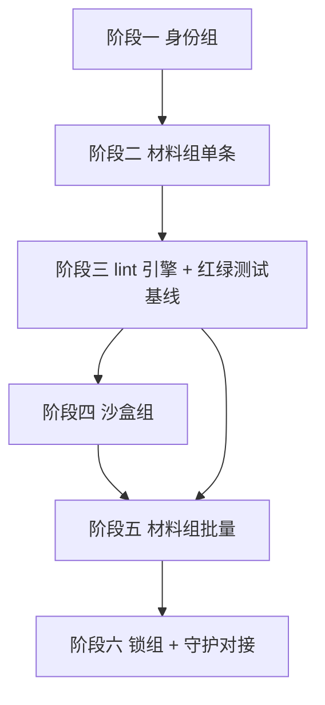

# plan 范本 — 一份合规 plan.md 长什么样

下面用一份示范用 plan 展示一份 v1 规范合规的 plan.md 完整字面形态. 示范的主题选 "omnicompany 注册中心实装", 因为它跟当前主线工作真有关联, 让范本不悬空.

注意: 这是**示范**, 不是真要立的 plan. 真要立的注册中心实装计划应当由用户拍板 + 走沙盒走注册流程产出, 不照抄这份.

落档位置按 binding.packages 主导决定. 这份 plan 主要改 `src/omnicompany/cli/` 代码, 顶层主题区是 `cli/` (代码模块名) → 落到 `docs/plans/cli/[2026-04-15]OMNICOMPANY-CLI-PHASE3/plan.md`. (cli/ 主题区当前还没建过, 这份就是首个; 新建顶层主题区允许, 名字要 match `src/omnicompany/cli/` 真实存在的代码目录.)

下面整段 markdown 就是 plan.md 的字面内容 (从 OmniMark 头开始):

---

```markdown

---
binding:
  workspace: omnicompany/
  packages:
    - core:cli
    - service:omnicompany
    - service:guardian
  targets:
    - team:omnicompany_cli_phase3
    - worker:register_identity
    - worker:register_material
    - worker:register_batch
    - worker:sandbox_check
    - worker:lock_open_close
    - material:omnicompany.identity_record
    - material:omnicompany.write_credential
    - material:omnicompany.lock_state
applicable_standards:
  - standards/_global/code.md
  - standards/_global/llm_first.md
  - standards/_global/counterexample_ledger.md
  - standards/concepts/material.md
  - standards/concepts/worker.md
  - standards/concepts/team.md
  - standards/cli/omnicompany_cli.md
  - standards/cli/sandbox.md
  - standards/cli/omni-header.md
expected_completion: 2026-05-01
ttl_days: 30
---

# omnicompany CLI 阶段三 · 注册中心实装

> 起源: 2026-04-15 设施层第二轮收官. [[standard:concepts/template]] / [[material:omnicompany.template]] /
> [[material:omnicompany.material]] / [[material:omnicompany.data]] / [[material:omnicompany.plan]] 等模板都立了,
> 沙盒目录也建了, OmniMark v3 升级跟 session 持久化都接通了, 但注册中心还没真做出来 —
> 没有它, `omni new` / `omni register` / `omni sandbox promote` 这些命令都不能跑, 上层模板系统是
> "规范立了但不能用"的状态. 阶段三集中实装注册中心, 让所有模板系统活起来.

---

## §1 · 主题

按 [[standard:cli/omnicompany_cli]] 草案的"实装顺序建议"段, 把身份组 + 材料组 (单条 + 批量) +
沙盒组 + 锁组 + 指引组逐段实装. 以"小步可验"为原则, 每段实装完真跑一次 + 走 [[worker:sandbox_check]]
自检 + 用户审过, 才进下一段.

## §2 · 起止日期

2026-04-15 起 — 2026-05-01 止 (估计 16 天, AI IDE 全职)

跟 binding.expected_completion (2026-05-01) + binding.ttl_days (30) 一致.

实际节奏可能慢于估计 — 注册中心是新代码不是改造存量, 阶段三第一段身份组 + 持久化已耗掉
2-3 天估计正常. 如果真延期超过 5 天, 进 §7 风险段重新评估.

## §3 · 参与方

- AI IDE 主实施 (写代码 + 写测试 + 跑自检)
- 用户审议四个关键决策点 (锁开关交付时机 / 批量注册兜底机制具体细节 / data 跟 material
  注册流程合并与否 / session 标识跨 compact 的真实可靠度)
- 守护 ([[worker:guardian_patrol]] / [[worker:doctor]]) 作 sidecar — 注册中心实装期间守护要继续跑,
  验证新写入没污染现存 data

## §4 · 关联材料

上游 (这份 plan 基于的已有材料):

- [[standard:cli/omnicompany_cli]] — 阶段三按这份 CLI 草案的接口契约实装
- [[standard:cli/sandbox]] — 沙盒规范定下的草稿 → 自检 → promote 流程
- [[standard:concepts/template]] + 现存四份模板 ([[material:omnicompany.template]] /
  [[material:omnicompany.material]] / [[material:omnicompany.data]] / [[material:omnicompany.plan]]) — 实装时按这些模板的注册件.yaml 配 lint
- [[material:omnicompany.session]] — session 持久化已实装的 Python 接口 (在 `src/omnicompany/core/session.py`)

输出 (这份 plan 完成时会产出的新材料):

- [[worker:register_identity]] + [[worker:whoami]] — 身份组两个 worker
- [[worker:register_material]] + [[worker:register_batch]] — 材料组两个 worker
- [[worker:sandbox_check]] + [[worker:sandbox_promote]] + [[worker:sandbox_archive]] + [[worker:sandbox_guide]] — 沙盒组四个 worker
- [[worker:lock_open_close]] + [[worker:lock_status]] — 锁组两个 worker
- [[worker:guide]] + [[worker:reflect]] — 指引组两个 worker
- [[material:omnicompany.identity_record]] + [[material:omnicompany.write_credential]] + [[material:omnicompany.lock_state]] — 三份新材料定义
- [[team:omnicompany_cli_phase3]] — 这一组 worker 跟 material 组成的团队
- 测试基线 (在 `tests/cli/{register,sandbox,lock}/` 三组)

跟 binding.targets 字段对齐 (头部声明 + 这里铺开).

## §5 · 阶段拆分



1. 身份组 ([[worker:register_identity]] / [[worker:whoami]]) + session 持久化整合 — 2 天
2. 材料组单条 ([[worker:register_material]]) + 路径校验 — 3 天
3. lint 引擎 + 三份模板的红绿测试基线 — 3 天
4. 沙盒组 ([[worker:sandbox_check]] / promote / archive / guide) — 3 天
5. 材料组批量 ([[worker:register_batch]]) + 部分失败 + 聚合报告 — 2 天
6. 锁组 ([[worker:lock_open_close]] / status) + 跟守护实时拦截对接 — 3 天

总 16 天 (跟 §2 估计一致). 每一阶段做完跟用户报告 + 用户审过才进下一段, 不一气推到底.

## §6 · 收尾条件

所有六段 CLI 命令真跑通, 端到端测试通过 (含: `omni new template` 实例化一份新 kind 模板真产四件套 +
`omni new material` 落一份真 material 定义 + `omni sandbox promote` 把草稿转正式区 +
`omni lock open/close` 两态都能切 + 红绿测试基线全过), 且锁打开后观察 24 小时零误伤.

四个用户审议点都拍板. [[note:PROGRESS]] 状态更新到"设施层全套完成".

## §7 · 风险

- **锁开关时机**: 锁打开瞬间, 现有大量未注册的 [[material:data.*]] / 散文档会被罚单化,
  守护误伤会多. 缓解: 阶段六打开锁前先跑一次大扫描, 给所有现存合规 data 补上 sidecar / 注册项,
  减少锁开瞬间的误伤量.
- **批量注册的部分失败兜底**: 大批量时部分失败 + 聚合报告这套机制, 没真跑过几次大批量就不知道
  边界值 (例如 100 条里 30 条失败时报告太长, 还是 1000 条里 5 条失败时报告太冷). 缓解: 阶段五先
  小批量 (10-20 条) 跑过, 调聚合报告格式, 再上大批量.
- **session 标识跨 compact 实际可靠度**: 当前依赖 hook 跟 jsonl 文件名反推, 多 session 并发时偶发
  race condition 没真验过. 缓解: 阶段一身份组实装时同时建并发测试基线, 跑两个 Claude Code 实例
  并发场景看 session ID 是否串台.

## §8 · 收尾归档位置

`docs/plans/cli/[2026-04-15]OMNICOMPANY-CLI-PHASE3/`

完成后:

- 这份 plan.md 留在原位, status 改 `completed`
- 同目录加 `compact_summary_2026-05-01.md` 按 §9-§13 + §14 五节填实施路径 / 假设 / 验证 / 实施 / 债务
- 走债务审议 (§14 债务清单段必填), 把实施过程产生的债务列档 + 处置
- 等 2-4 周冷静期后搬到 `docs/plans/cli/_archive/[2026-04-15]OMNICOMPANY-CLI-PHASE3/` (主题区内归档)
- [[note:PROGRESS]] 加一条最新状态指向这份归档, 5-8 条满了挤掉旧的
```

---

## 关于这份范本的几点说明

**OmniMark 头 v3 五字段齐全**: type=plan, agent 字段跟创建者 session 关联. 注意 origin 是 ai-ide 不是 human (这是 AI IDE 写的 plan, 用户手写 plan origin 用 human).

**binding 块按规范第三节填全**: workspace 单值 / packages 三条 / targets 含具体 worker 跟 material / applicable_standards 推导 + 手补 / expected_completion 跟 §2 一致 / ttl_days=30 (1 个月跨度).

**章节用 §1-§8 编号** (固定 8 节): §1 主题 → §2 起止 → §3 参与方 → §4 关联材料 → §5 阶段拆分 → §6 收尾条件 → §7 风险 → §8 收尾归档位置. 跟 plan 规范第五节定义一致.

**起源段 quote 不在 8 节里**: 在 8 节之前, 主标题之后, 有一段 `> 起源:` 引用块写"为什么立这份 plan", 跟 OmniMark `why` 字段意思接近但更详细.

**正文一律用 wikilink**: §3 参与方提到 worker 用 `[[worker:guardian_patrol]]`, §4 关联材料用 `[[standard:cli/omnicompany_cli]]` / `[[material:...]]`, §5 阶段拆分提到 worker / material 都用 wikilink. 不用普通 markdown 链接 (除非链外部 URL). dashboard 当前不识别的 wikilink (例如 `[[standard:xxx]]`) 渲染成 plain text 但仍可读, dashboard 后续加 entity handler 自动激活.

**§5 阶段拆分用 mermaid 块画依赖**: 比 ASCII 表清晰, dashboard 直接渲染.

**落档位置按主题区单轴决定**: 这份 plan 主改 `src/omnicompany/cli/`, 顶层主题区是 `cli/` (代码模块名). 涉及多 package 时取主导一个, 不再用 `_cross/`. 不平铺到 `docs/plans/[date]TOPIC/`. 详见 [[standard:_global/distributed-docs]] §5.3.

**真示范不是真要立的 plan**: 内容跟当前主线相关, 但不要照抄当作真 plan 用 — 真要立时由用户拍板, 走沙盒 → 注册流程产出. 范本只是"长什么样" 的形态参考, 不是"内容"参考.
