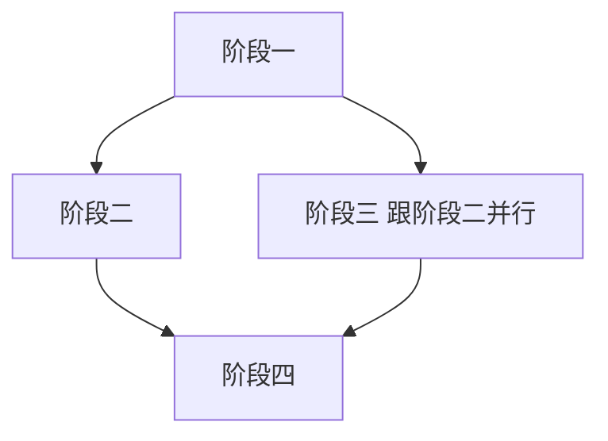
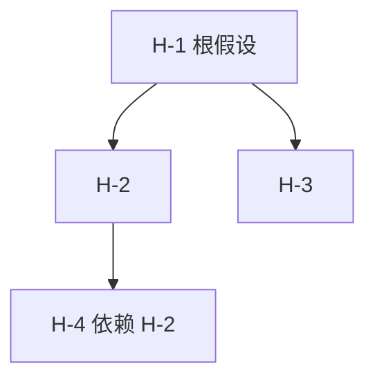

# 立一份新 plan 的骨架 — 复制下面整段 markdown, 填空

## 落档位置 (按 binding.packages 决定)

| 工作性质 | 落到的目录 |
|---|---|
| 改具体代码模块 | `docs/plans/<代码模块名>/[<起始日期>]<主题代号>/plan.md` |
| 服务具体业务域 | `docs/plans/<业务域名>/[<起始日期>]<主题代号>/plan.md` |
| 跨切面方法论/元能力 | `docs/plans/omnicompany-<能力名>/[<起始日期>]<主题代号>/plan.md` |
| 主题区内归档 | `docs/plans/<主题区>/_archive/[<起始日期>]<主题代号>/` |

主题区 (顶层目录) 当前已有: `agent-framework` / `dashboard` / `diagnosis` / `format-material` / `guardian` / `stage-experiments` / `voxel_engine` / `gameplay_system` (代码模块或业务域名) + `omnicompany-计划跟进` / `omnicompany-调研吸收` (行政层, 候选能力还有 `生成改进` / `体验评估` / `总结发布`).
落档判定顺序: 改具体代码 → 那段代码的模块名; 服务具体业务 → 业务域名; 跨切面方法论/不绑代码 → `omnicompany-<能力名>`. 判定不出时优先代码模块 > 业务域 > 行政层. 详见 `docs/standards/_global/distributed-docs.md` §5.3.

---

## 复制下面整段到选定目录的 plan.md

```markdown
<!-- [OMNI] tags=plan,<主题领域>,<阶段标签>,<其他你需要的>

---
binding:
  workspace: <项目相对路径, 必填单值, 例如 omnicompany/ 或 omnicompany/src/omnicompany/packages/services/guardian/ 或 omnicompany/data/_workspaces/<team>/<job>/>
  packages:
    - <service:<name> 或 domain:<name> 或 core:<name> 或 protocol:<name>, 0-N 项>
    # ... 多绑就多列
  targets:
    - <team:<name> / worker:<name> / material:<id> / agent:<name> / hook:<name> / tool:<name> / plan:<topic>, 0-N 项>
    # ... 多绑就多列
applicable_standards:
  # 自动推导 (按 targets / packages 类型) + 手补
  - standards/_global/code.md           # 任何 plan 都自动加
  - standards/_global/llm_first.md      # 任何 plan 都自动加
  - <按需加 standards/concepts/<kind>.md / standards/cli/<x>.md / standards/protocol/<x>.md>
expected_completion: <YYYY-MM-DD, 必填, 跟 §2 起止日字段一致>
ttl_days: <整数, 必填, 推荐 30-90, 超过 3 个月的拆 plan>
---

# <计划主题>

> 起源: <2-3 句话讲这份 plan 的起因, 比 OmniMark `why` 字段详细一点, 例如"X 阶段做完了, Y 是下一步, 起因是发现 Z 问题..." 这种>

---

## §0 · 起源 (可选, 长 plan 才用)

<如果计划复杂, 这里展开起因 / 关键决策 / 立项哲学 / 跟其他 plan 的关系等. 简单 plan 这一节可省, 直接进 §1>

跨 plan 引用用 wikilink: `[[plan:OTHER-TOPIC]]`.

## §1 · 主题

<2-3 句话讲这份计划要做什么, 跨越的范围, 大致目标. 不堆代号, 中文铺开>

## §2 · 起止日期

<起始日期, ISO 8601 格式 YYYY-MM-DD> 起 — <预期结束日期> 止 (估计 <X 天/周>, <谁> 全职/兼职)

跟 binding.expected_completion 字段值一致 (头部 yaml 跟正文段冗余但显式).

## §3 · 参与方

- <谁主实施>
- <谁审议关键决策点>
- <其他参与方, 例如守护作 sidecar / 用户作上游决策>

## §4 · 关联材料

上游 (这份计划基于哪些已有材料):

- `[[material:<domain.id>]]` <一句话讲这份材料在 plan 里的角色>
- `[[plan:<OTHER-TOPIC>]]` <跨 plan 引用, 标这份 plan 跟其他 plan 的关系>
- `[[standard:<分类>/<name>]]` <用到的具体规范, 例如 standard:concepts/material>

输出 (计划完成时会产出哪些新材料):

- `[[material:<new.id>]]` <一句话讲这份材料是这个 plan 的产出物>
- `[[worker:<new_name>]]`
- `[[team:<new_name>]]`

跟 binding.targets 字段对齐 (头部声明 + 正文铺开).

## §5 · 阶段拆分

1. <阶段一名称> — <估计天数> — 涉及实体: `[[worker:foo]]` / `[[material:bar]]`
2. <阶段二名称> — <估计天数> — 涉及实体: ...
3. <阶段三名称> — <估计天数> — ...

阶段总天数加起来跟 §2 估计天数一致.
每阶段做完跟用户报告 + 用户审过才进下一段, 不一气推到底.

推荐阶段拆分用 mermaid 块画依赖图:



## §6 · 收尾条件

<什么发生算这份计划完成 — 一两条客观可测条件>

跟 §4 输出材料 + binding.targets 对齐 — 输出都齐了 + 通过验证 = 收尾.

## §7 · 风险

- <已识别风险 1>: <描述> + 缓解办法: <具体动作>
- <已识别风险 2>: <描述> + 缓解办法: <具体动作>
...

2-5 条比较合理 — 太少 = 没识别清, 太多 = 想得太散.

## §8 · 收尾归档位置

按 binding.packages 决定原位置 + 冷静期 2-4 周后归档区:

- 原位置: `docs/plans/<package_path>/[<起始日期>]<主题代号>/`
- 归档区 (冷静期过): `docs/plans/_archive/<package_path>/[<起始日期>]<主题代号>/`

完成后:

- 这份 plan.md 留在原位, status 改 `completed`
- 同目录加 `compact_summary_<完成日期>.md` 按 §9-§13 五节填实施路径 / 假设 / 验证 / 实验
- 走债务审议 (§7 风险段补 + 必要时新立接手 plan 用 `[[plan:NEW-TOPIC]]` 链接)
- 等 2-4 周冷静期过后再搬到归档区
- docs/PROGRESS.md 加一条最新状态指向这份归档

---

## §9 · 工作性假设 (compact summary 时机才必有, 常规 plan 可省)

跟这份计划绑定的工作性假设, 每个 worker / team / 阶段至少 1 条. 形如:

- "假设 [X 内容] 可以在 [Y 情况] 下工作"
- "假设 [X SOP] 可以在 [Z 信息空间] 内处理好这件事"

写在哪: 普通 plan 编辑时这一节可省 (假设落到对应 service 的 DESIGN.md). compact summary trigger 触发时, 把当前活跃的工作性假设全部抓回来在这一节列, 让接手的人能一眼看到决策依据.

## §10 · 验证情况 + 验证背后的假设 (compact summary 时机才必有)

关键产物的验证情况:

| 产物 | 是否验证 | 验证方法 | 结果 |
|---|---|---|---|
| `[[material:<id>]]` | Y/N | 跑 `omni sandbox check ...` | PASS/FAIL |

每个验证背后的假设 (形如 "如果 [X 健康], 那 [Y] 应当表现为 [Z]"):

- <假设 V-1>
- <假设 V-2>

## §11 · 假设树 (compact summary 时机才必有)

§9 + §10 列出的假设之间的依赖关系. 推荐 mermaid:



共同假设 + 依赖链也在这里点出.

## §12 · 假设验证情况 + 一句话总览 (compact summary 时机才必有)

每个假设的验证状态 (完全证明 / 部分证明 / 完全证否 / 未确认), 来源标注 (用户确认 / 网络可证 / 本地可搜 / 待确认):

| 假设 | 状态 | 来源 |
|---|---|---|

**一句话总览** (≤ 200 字, 必含五件: 做了什么 / 运行了什么 / 结果如何 / 如何证明 / 合理依据):

> <这里写一句话总览>

## §13 · 实施情况 (compact summary 时机才必有)

每个 worker / team / 阶段的实施情况:

- 运行日志位置: <具体路径>
- 数据库 (events.db / sqlite bus) 是否有: Y/N + 搜索证明 (粘 grep / sqlite query 命令 + 输出片段)
- 实施结果 (PASS / FAIL / 无结果)
- 没有数据的话: 接事件总线时间表 (一切有意义产物必留痕, 不留痕 = 没做)

## §14 · 债务清单 (收尾必填)

实施过程中产生的债务. 每项标注:

| 债务 | 类型 | 严重度 | 处置 |
|---|---|---|---|
| <债务描述> | 代码 / 文档 / 测试 / 配置 | blocker / major / minor | 已解决 / 新立 `[[plan:接手]]` / 接受为永久债务 |

收尾时 (status 改 completed 之前) 必走债务审议. 不允许"待补"开放项.

```

---

## 整体检查项 (填完所有字段后再走一遍)

- [ ] OmniMark 头五字段齐 (origin/ts/summary/why/tags), is_canonical_v3 通过
- [ ] type 字段是 `plan`
- [ ] tags 至少含 `plan`
- [ ] **binding 块完整**: workspace 必填单值, packages / targets 至少有一个 (除非真无关任何包跟实体的纯思考 plan), applicable_standards 含 `_global/code.md` 跟 `_global/llm_first.md`, expected_completion 跟 ttl_days 都填
- [ ] **正文用 wikilink 引用其他实体**: §4 关联材料 / §5 阶段拆分 / §10 验证表 等都用 `[[type:id]]` 不用普通 markdown 链接 (除非链外部 URL)
- [ ] §1 - §8 八节顺序按字面对齐, 不重排
- [ ] 主题段 ≥ 30 字符 (能复述核心目标)
- [ ] §2 起止日期跟 binding.expected_completion 一致
- [ ] §4 关联材料的 targets 跟 binding.targets 对齐 (头部声明 + 正文铺开)
- [ ] 阶段拆分至少 3 个阶段, ≤ 8 个 (≤ 8 是 plan 范围, > 8 是项目应当拆)
- [ ] 阶段总天数加起来跟起止日期估计一致
- [ ] 收尾条件可测 (有客观标准, 不是"差不多就行")
- [ ] 风险段 2-5 条 + 缓解办法
- [ ] **目录结构合规**: 落到主题区 (代码模块名 / 业务域名 / `omnicompany-<能力名>`) 下的 `[date]TOPIC/`, 不走旧的 `_infra/` `_cross/` `domain/` `_projects/` `_capabilities/` 路径, 不平铺到 `docs/plans/[date]TOPIC/`
- [ ] 起始日期跟目录名的 `[YYYY-MM-DD]` 一致
- [ ] 主题代号是大写蛇形, 不挂版本号
- [ ] **跨度 ≤ 3 个月**: ttl_days 在 30-90 区间, 长跨度的拆成多份 plan

### compact summary 时机额外检查项 (普通 plan 编辑时不查)

- [ ] §9 工作性假设填了 (每个 worker / team / 阶段至少 1 条)
- [ ] §10 验证情况列了关键产物 + 每个验证背后的假设
- [ ] §11 假设树画了依赖关系 (推荐 mermaid)
- [ ] §12 假设验证状态 + 来源标注 + 一句话总览 (≤ 200 字)
- [ ] §13 实施情况含运行日志位置 + 数据库证明 + 实施结果

### 收尾必填检查项

- [ ] §14 债务清单填了 (status 改 completed 之前必走债务审议)
- [ ] 每项债务有处置 (已解决 / 新立接手 plan / 接受为永久债务), 没"待补"开放项

### 三层对应声明

- [ ] plan 对应协议层 Format (markdown 类纯数据材料), 对应 SKILL 实施层 §0 调研 + §11 落档. 在 omnicompany 概念分类里归"文档体系" 下 (跟 report / DESIGN 平行, DESIGN 归 team 一部分).
